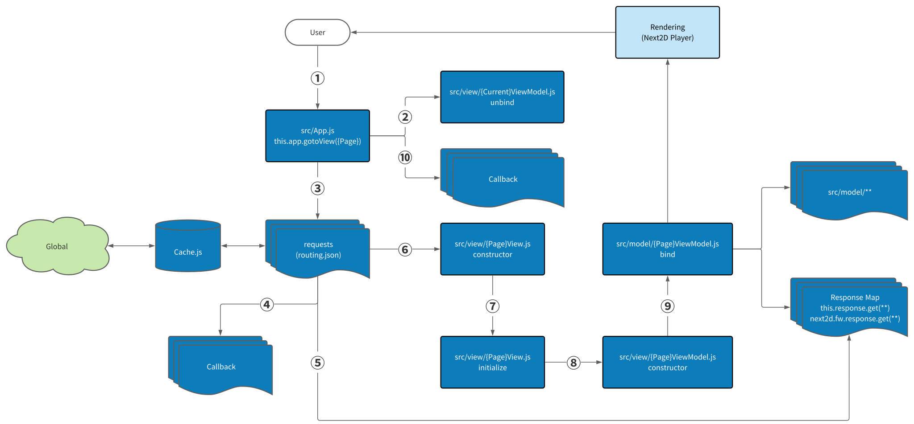

Next2D Framework
=============


[](https://github.com/Next2D/Framework/actions/workflows/integration.yml)
[](https://github.com/Next2D/Framework/actions/workflows/codeql-analysis.yml)
[](https://github.com/Next2D/Framework/actions/workflows/lint.yml) \
[](https://github.com/Next2D/Framework/releases)
[](https://github.com/Next2D/Framework/blob/main/LICENSE)
[](https://next2d.app/docs/player/index.html)
[](https://discord.gg/6c9rv5Uns5)
[](https://twitter.com/intent/user?screen_name=Next2D)


Next2D Framework for the Model-View-ViewModel(MVVM) pattern.

## Quick Start

Create Next2D apps with no build configuration.
```sh
npx create-next2d-app app-name
cd app-name
npm start
```

## Directory Configuration

```sh
project
├── src
│   ├── index.js
│   ├── App.js
│   ├── Packages.js // It will be generated automatically.
│   │
│   ├── component
│   │   └── default empty
│   │
│   ├── config
│   │   ├── config.json  // Configuration files for each environment.
│   │   ├── routing.json // Request settings before loading the view.
│   │   ├── stage.json   // Display(Stage) area setting. 
│   │   └── Config.js    // It will be generated automatically.
│   │
│   ├── content // Symbolic access to JSON created with NoCode Tool
│   │   ├── top
│   │   │   └── TopContent.js
│   │   └── home
│   │       └── HomeContent.js
│   │
│   ├── image
│   │   └── default empty
│   │
│   ├── model // business logic
│   │   ├── callbask
│   │   │   └── Background.js
│   │   ├── api
│   │   │   └── HomeText.js
│   │   └── default empty
│   │
│   └── view // Per-page View, ViewModel files.
│       ├── top
│       │   ├── TopView.js
│       │   └── TopViewModel.js
│       └── home
│           ├── HomeView.js
│           └── HomeViewModel.js
│
└── __tests__ // Unit Test directory
    └── model
        └── default empty
```

## Chart Flow


## Commands

* Starts the development server.
```sh
npm start
```

* Generate the necessary View and ViewModel classes from the routing JSON file.
```sh
npm run generate
```

* Bundles the app into static files for production.
```sh
npm run build -- --env="prd"
```

* Starts the test runner.
```sh
npm test
```

## Configuration JSON

### stage.json

| name | value | default | description |
| --- | --- | --- | --- |
| `width` | number | 240 | This is the setting for the width of the display area. |
| `height` | number | 240 | This is the setting for the height of the display area. |
| `fps` | number | 12 | The number of times to draw per second. |

#### Option settings

| name | value | default | description |
| --- | --- | --- | --- |
| `base` | string | empty | When acquiring JSON by relative path, the URL set here will be applied as the root. For absolute paths, the URL set here will not be applied. |
| `fullScreen` | boolean | false | It will be drawn on the entire screen beyond the width and height set in the Stage class. |
| `tagId` | string | empty | When an ID is specified, drawing will be performed within the element with the specified ID. |
| `bgColor` | The [R,G,B,A] array of background colors can be specified from 0 to 255. false is colorless and transparent. |

### config.json

You can set a common value for each environment.\
The values below all are available for all environments.

| name | value | default | description |
| --- | --- | --- | --- |
| `spa` | boolean | true | As a Single Page Application, the scene can be controlled by URL. |
| `loading`.`callback` | string | Loading | Sets whether or not to display the loading screen until the preparation for screen transition is complete. Call the start and end functions of the class set as callback. |
| `gotoView`.`callback` | string or array | null | You can specify the class to call back after the `gotoView` function finishes. |

### routing.json

| name | value | default | description |
| --- | --- | --- | --- |
| `private` | boolean | false | Controls direct access; if set to true, TopView will be activated. |
| `requests` | array | null | Send a request to the specified location before accessing the View. The information received will be set in next2d.fw.response with name as the key. |

#### Properties that can be set in the `requests` property.

| name | value | default | description |
| --- | --- | --- | --- |
| `type` | string | `content` | The following fixed values are available for this property. `json`, `content`, `image` and `custom` |
| `path` | string | empty | Get the value of the string enclosed in {{***}} from config.json. e.g. {{ api.endPoint }}path/to/api |
| `name` | string | empty | When the name is set, the data retrieved with the name as the key will be set in the Response Map. |
| `cache` | boolean | false | Caches the retrieved data using the value set in name as a key. |
| `callback` | string or array | null | You can specify the class to call back after the request is completed. The value will be set to the first argument of the contractor of the specified class and will be taken over. |
| `class` | string | empty | You can specify the class that will execute the request. (it will only be invoked when type is custom) |
| `access` | string | `public` | Allows you to specify access to the function that will perform the request. You can specify `public` or `static`. (Only invoked when type is custom). |
| `method` | string | empty | You can specify a function to execute the request. (only fired when type is custom). |

## License
This project is licensed under the [MIT License](https://opensource.org/licenses/MIT) - see the [LICENSE](LICENSE) file for details.